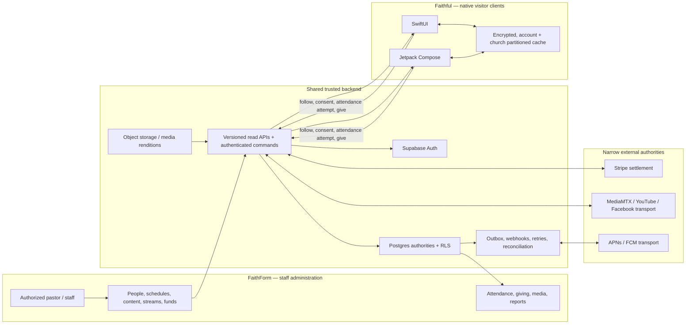

# FaithForm / Faithful source-of-truth map

> **Revalidated 2026-08-24 at `9bdbbaf`.** Every owner, state, and evidence path below was re-verified in source. Two rows changed: the stream publish key row (resolved in Prompt 2) and the Churches row (church creation is now decoupled from admin invitation). All other authorities, the identity key lock, the attendance convergence model, and the no-duplication constraints are unchanged. See `01_REPOSITORY_AUDIT.md` § Revalidation addendum.

Audit date: 2026-08-19

## Authority rules

“Current authority” names the repository-backed owner today. “Locked target” states the owner later prompts must preserve or establish; it does not claim missing structures already exist.

The core rule is: **FaithForm administers one shared backend; Faithful reads published state and submits constrained actions back to that backend.** Native caches are replaceable replicas. No mobile-only People, church, content, attendance, or donation database is permitted.

## Authoritative owners

| Domain | Current authority | State | Locked target and write boundary | Evidence |
|---|---|---|---|---|
| Churches | `public.churches` in Supabase/Postgres | Ready for single-church staff context; Partial for discovery/campuses | Same church row remains tenant root. FaithForm/platform onboarding writes configuration — as of `9bdbbaf` a church row may exist before any admin is invited, so Faithful discovery must tolerate a church with zero `church_users` rows. Faithful may discover only explicitly public fields. Add campuses as children; do not duplicate churches. | `supabase/migrations/0001_schema.sql:10-15`; onboarding updates at `app/onboarding/actions.ts:150-159` |
| Accounts | Supabase Auth `auth.users.id` | Partial | Supabase Auth remains credential authority. Add an app-owned profile for user preferences/privacy state. Faithful users write only their own profile through constrained APIs/RLS. | `lib/supabase/middleware.ts:62-93`; `lib/auth/church.ts:62-72` |
| Staff memberships | `public.church_users` | Ready for current dashboard model; not a visitor model | Keep exclusively for FaithForm staff tenant access/roles. Do not place visitors here. | `supabase/migrations/0001_schema.sql:21-28`; `app/dashboard/settings/team-actions.ts:150-181` |
| Visitor follows/memberships | `public.visitor_church_relationships` | **Implemented (Prompt 3)** | New account-to-church relationship in shared Postgres with follow/join/pending/left semantics and tenant-safe uniqueness. Faithful initiates allowed transitions; FaithForm approves only when policy requires it. | `supabase/migrations/0053_visitor_identity.sql`; state machine at `lib/faithful/relationship-state.ts` |
| People | `public.members` | Partial | `members.id` remains the church-owned operational person. FaithForm owns create/edit/merge/deactivate. Faithful can claim/link through a verified workflow, never by automatic email match. | `supabase/migrations/0001_schema.sql:34-44`; `app/dashboard/people/actions.ts:1-220` |
| Account ↔ People linkage | `public.visitor_people_claims` + `public.visitor_people_links` | **Implemented (Prompt 3)** | New tenant-scoped link from `auth.users.id` to existing `members.id`, server-created after verified claim/admin resolution; uniqueness prevents multiple active claims. | `supabase/migrations/0053_visitor_identity.sql`; one active link per `member_id` and per `(account_id, church_id)` |
| Households/dependents | None | Missing | If product-approved, add relationships around existing `members`; never replace People. Guardian/dependent permissions require separate privacy rules. | No household/dependent model found |
| Service schedules | `public.church_service_times` | Partial | FaithForm owns recurring definitions. Add campus, timezone/exception/window data and materialized `service_occurrence` authority for check-ins. | `supabase/migrations/0038_church_profile.sql:64-83` |
| Attendance | `attendance_records` + `attendance_entries` | Partial | Evolve into one canonical occurrence-level counted fact per `(service_occurrence_id, member_id)`. FaithForm owns schedules/corrections; manual, geofence, QR, kiosk, and admin commands all use one server idempotency path. Preserve People linkage. | `supabase/migrations/0001_schema.sql:50-68`; current two-step save at `app/dashboard/attendance/(record)/[date]/actions.ts:136-190` |
| Aggregate `attendance` table | `public.attendance` exists but no app use was found | Dead/parallel risk | Do not adopt it for Faithful. Reconcile/deprecate through a separately reviewed migration only after live-data verification. | `supabase/migrations/0003_weekly_inputs.sql:12-19`; zero `.from("attendance")` calls found |
| Announcements | `public.announcements` | Partial | FaithForm owns drafts/schedules/publication. Faithful reads only a stable published projection/version and never draft/provider fields. | `supabase/migrations/0001_schema.sql:74-86`; publish path `app/dashboard/announcements/actions.ts:103-154` |
| Events | Event-shaped fields in `public.announcements`; external Google/Facebook IDs on the same record | Partial | Preserve the existing record initially. Define a published event projection/occurrence contract; split authoring models only if later requirements prove necessary. | `supabase/migrations/0005_announcement_scheduling.sql:3-59`; `supabase/migrations/0009_announcement_integrations.sql:3-82` |
| Announcement artwork | `social_graphic_path/url` plus `social-graphics` storage | Partial | Object storage owns bytes; the announcement published version owns immutable rendition metadata. FaithForm generates/uploads; Faithful reads CDN-safe renditions. | `app/dashboard/announcements/actions.ts:127-154`; `supabase/migrations/0023_social_assets.sql:140-174` |
| Livestream events | `public.stream_events` | Partial | Same event row owns scheduled/live/ended product state. FaithForm schedules/starts; verified server/provider/relay events advance lifecycle. | `supabase/migrations/0033_stream_scheduling.sql:3-35`; `lib/stream/go-live.ts:39-193` |
| Livestream sessions | `public.stream_sessions` | Partial | One active operational session per church remains authoritative for ingest lifecycle; never expose ingest credentials to Faithful. | `supabase/migrations/0032_stream_production.sql:25-47` |
| Livestream recordings | `public.stream_recordings` metadata; private `stream-recordings` bucket bytes | Partial | Recording row owns processing/readiness/publication/visibility/retention; object storage/CDN owns renditions. Completion must be idempotently correlated to the ended session/event. | `supabase/migrations/0034_stream_recordings.sql:3-21`; upload callback `app/api/stream/recording-complete/route.ts:12-70` |
| Media series/views | `public.media_series`, `public.media_views` | Partial | Reuse for recording taxonomy and aggregate analytics after tenant/public validation is tightened. Do not use views as identity or attendance. | `supabase/migrations/0047_media_library.sql:12-102` |
| Sermon Builder presentations | `public.sermons` editable JSON plus series/assets | Partial authoring; Missing archive | FaithForm keeps the editable sermon. Add immutable published presentation versions/manifests/renditions linked to `sermons.id`; Faithful is read-only. Do not rebuild the editor natively. | `supabase/migrations/0006_sermon_builder.sql:38-80`; `types/sermon.ts:1-121` |
| Website sermon/media | `public.site_media` | Partial, separate | Keep as the website’s manual external-media source unless a later explicit migration maps published recordings/presentations. Do not silently treat it as Sermon Builder output. | `supabase/migrations/0042_church_sites.sql:175-199` |
| Donation funds | `public.giving_funds` | Partial | Same table remains fund authority. FaithForm financial/admin roles configure it; Faithful reads active published funds. Add campaign fields only when product semantics are fixed. | `supabase/migrations/0016_giving_enhancements.sql:16-29`, `:106-110` |
| Donations | `public.giving_donations`; Stripe owns settlement | Partial | Stripe owns payment state/money movement; server-verified webhooks reconcile the shared ledger. Faithful never writes ledger status directly. | `supabase/migrations/0013_stripe_giving.sql:53-79`; `app/api/webhooks/stripe/route.ts:9-38` |
| Recurring gifts | `public.giving_subscriptions`; Stripe subscription/customer | Partial | Same split: Stripe is provider authority, Postgres is product/reporting projection. Mutations require verified donor session and provider idempotency. | `supabase/migrations/0013_stripe_giving.sql:85-115`; `lib/stripe/webhooks.ts:229-560` |
| Donors | `public.giving_donors` keyed by `(church_id,email)` | Partial | Retain donor/reporting identity, but link it explicitly to account/People when verified. Do not equate an email row with authentication. | `supabase/migrations/0016_giving_enhancements.sql:35-47` |
| General media assets | Supabase Storage buckets plus domain rows | Partial | Storage/CDN owns bytes; domain tables own tenant, purpose, lifecycle, visibility, renditions, and deletion. Every object path must be tenant-authorized. | logo bucket at `supabase/migrations/0015_onboarding.sql:57-96`; recording bucket script `scripts/ensure-storage-buckets.mjs:5-90` |
| Push installations/preferences | None | Missing | New account/device-scoped installations and per-church/topic preferences in shared Postgres. Faithful registers/rotates its own token; server outbox owns APNs/FCM dispatch/retries/receipts. | `push_to_app` exists at `supabase/migrations/0001_schema.sql:74-85`, but publish hardcodes false at `app/dashboard/announcements/actions.ts:136-154` |
| Design system | CSS variables/Tailwind and React primitives | Partial | Add a platform-neutral token/behavior specification as canonical design data; SwiftUI and Compose each render native components from it. | `app/globals.css:5-60`; `tailwind.config.ts:10-70`; `components/ui/button.tsx:6-40` |

## Identity key lock

These identifiers have distinct authority and must not be collapsed:

| Identifier | Meaning | May be exposed to Faithful? | Rules |
|---|---|---|---|
| `auth.users.id` | Global credential/account | Yes, only as the signed-in user’s own subject or opaque API context | Never grants a church role by itself. |
| `church_users.id` | FaithForm staff membership | No general visitor use | Dashboard-only tenancy/role relation. |
| `members.id` | Church-owned person/attendee | Only through a tenant-safe account link and need-to-know responses | Existing attendance foreign key; never infer ownership from email alone. |
| visitor church relationship ID | Follow/join state | Yes, for the owning account | New record; separate from staff access and People. |
| `giving_donors.id` | Church-specific donor/reporting identity | Only through verified donor/account access | Email match is a candidate, not authentication. |
| Stripe customer/payment/subscription IDs | Provider references | Server only unless provider SDK requires a short-lived client secret | Never authorize with a raw ID or email. |
| stream ingest capability | Scoped, expiring ingest credential | Never | **Resolved in Prompt 2:** the persistent publish key no longer appears in playback URLs. Viewer playback is a separate short-lived HMAC capability bound to church, event, audience, and expiry (`lib/stream/playback.ts:55-108`). Faithful receives a viewer capability only — never ingest material. |

## Attendance convergence model

The current `attendance_records` header and `attendance_entries` rows are the data to preserve, but the service-date batch is not sufficient for multiple services/campuses. Later migrations must evolve—not fork—the model:

1. FaithForm service schedule + exception creates/resolves one immutable service occurrence.
2. A manual, admin, kiosk, QR, or geofence client submits an attendance **attempt** with authenticated actor/device, source, occurrence, People link, idempotency key, and minimally retained evidence.
3. A server command validates tenant, schedule/window, source policy, consent, and People link.
4. A database constraint/transaction upserts one counted attendance fact for `(service_occurrence_id, member_id)`.
5. Attempts/audit records preserve provenance without incrementing attendance twice.
6. The existing FaithForm Attendance and People history read the same counted fact.

This is required because current code checks uniqueness before two separate inserts and the database has no `(church_id,service_date)` uniqueness (`app/dashboard/attendance/(record)/[date]/actions.ts:136-190`, `supabase/migrations/0001_schema.sql:50-68`).

## Publication lifecycle lock

| Domain | Editable state | Publication boundary | Faithful-readable state |
|---|---|---|---|
| Announcements/events | Existing `announcements` draft/scheduling fields | Server publication produces/updates a stable published projection and enqueue record | Only active, targeted published versions; cursor-paged and cache-versioned |
| Livestream | `stream_events` scheduled configuration | Verified start/end plus recording processing | Scheduled/live event projection; then only recording versions whose publication/visibility permits access |
| Sermon Builder | Existing `sermons` JSON/editor state | Explicit publish creates immutable manifest/renditions version | Published version metadata and read-only rendition; never the editor mutation surface |
| Funds/campaigns | `giving_funds` plus future campaign configuration | Explicit active/published financial configuration | Active funds/campaigns; payments always start with a server-created provider operation |

## Data flow

## No-duplication constraints

- Do not create a visitor copy of `churches` or `members`.
- Do not adopt the unused aggregate `attendance` table as a second attendance authority.
- Do not write separate attendance rows per source; source-specific attempts converge on one counted fact.
- Do not treat `site_media` as Sermon Builder output without an explicit mapping/migration.
- Do not store authoritative payment status on-device or accept it from a client callback.
- Do not expose staff `church_users` access to visitors.
- Do not share UI implementation between SwiftUI and Compose; share versioned contracts, tokens, semantics, and fixtures.
