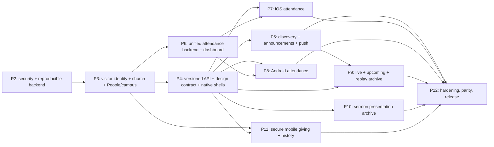

# FaithForm / Faithful implementation sequence

Audit date: 2026-08-19

Applies to: Prompts 2–12

## Why this order is locked

The repository is much more complete than a greenfield dashboard, but its existing identity is staff-only, no native app exists, and the current public giving/live paths contain security blockers. The sequence therefore begins with deployment/security and shared identity/contracts, then builds native foundations, then ships vertical slices.

The dependency chain is:

## Ownership ledger

Each schema family and cross-cutting concern has one owning prompt. A later prompt may consume or narrowly extend it, but must not create a parallel authority.

| Ownership | Prompt | Later consumers |
|---|---:|---|
| Deployment drift baseline, critical security fixes, test foundation | 2 | All |
| Visitor profiles, church follow/join, account↔People link, campuses | 3 | 4–12 |
| Mobile API conventions, neutral design tokens, iOS/Android shells | 4 | 5–12 |
| Discovery projections, announcement publication, push installations/outbox | 5 | 9, 12 |
| Service occurrences, attendance attempts/counted fact, all source convergence | 6 | 7, 8, 12 |
| iOS background/geofence client | 7 | 12 |
| Android background/geofence client | 8 | 12 |
| Mobile stream projections/playback and recording archive pipeline | 9 | 12 |
| Immutable published sermon presentation versions/renditions | 10 | 12 |
| Secure donor/account linkage, mobile payment commands/history | 11 | 12 |
| Cross-domain reliability, observability, privacy, stores/release | 12 | — |

## Gates that apply to every implementation prompt

1. Start from a clean status and preserve user work.
2. Inspect deployed migration state before writing/applying a migration; rehearse on non-production first.
3. Add tenant/RLS tests for owner, another church, unauthenticated user, and service worker where applicable.
4. Authenticate and authorize every command server-side; never trust a client church/member/record ID.
5. Add an idempotency key or unique event claim before any retryable mutation, webhook, upload finalization, push, or background check-in.
6. Bound every new list and use a stable cursor. Validate indexes against its exact filter/order with `EXPLAIN (ANALYZE, BUFFERS)` on production-like cardinality.
7. Version mobile DTOs/errors and maintain compatibility fixtures before updating either native consumer.
8. Define offline freshness, retry, cache partition, revocation, and logout purge for every native read/write.
9. Never log tokens, payment details, message bodies, precise location trails, or congregation personal data.
10. Run lint/build plus relevant unit, integration, RLS, contract, UI, native, webhook, and migration tests. The current CI has only lint/build (`.github/workflows/ci.yml:8-29`), so each phase must add its own gates.

## Prompt 2 — Security remediation and reproducible production baseline

**Goal**

Make the existing FaithForm backend safe and reproducible before exposing it to native clients.

**Dependencies**

- Authorized read-only inventory of production and a writable non-production Supabase project.
- Access to Vercel, stream relay scheduling/configuration, Stripe test mode, and storage settings.
- Rotation plan for stream publish credentials, because the current public playback URL contains them (`lib/stream/playback.ts:57-73`).

**Exact systems affected**

- Donor portal route/session paths, stream playback/auth, public live chat/views.
- Cross-tenant stream administration actions and integration-token storage/grants.
- Supabase storage policies and migration/deployment checks.
- Rate limiting, production env validation, webhook/receipt claims.
- Production dependency upgrades and vulnerability scanning.
- CI and initial automated test harness.

**Existing components to reuse**

- HMAC donor session primitives (`lib/giving/portal-session.ts`).
- Timing-safe secret comparison and stream token code (`lib/security/compare-secret.ts`, `lib/stream/playback.ts`).
- Core RLS helpers and existing migration checker scripts.
- Stripe raw-body signature route (`app/api/webhooks/stripe/route.ts:9-38`).

**Required migrations or API work**

- Remove/disable email-only billing portal creation or make it require the verified donor session; correct cookie scope and atomically consume magic-link tokens (`app/api/give/portal/route.ts:14-75`, `lib/giving/portal-session.ts:104-179`).
- Separate short-lived viewer authorization from the persistent relay publish key; rotate existing keys and make HLS proxy/relay enforce the viewer capability.
- Bind logo/cover/social object paths to authorized tenant IDs in storage policies (`supabase/migrations/0015_onboarding.sql:73-96`, `supabase/migrations/0038_church_profile.sql:174-196`).
- Validate live chat/view event↔church↔publication relationships and add abuse controls.
- Scope scheduled-stream cancellation and chat moderation by the authenticated admin's church before any service-role update.
- Remove authenticated-client access to integration token columns/RPCs; expose a status-only projection and keep OAuth/stream secrets behind server-only services. Rotate credentials whose exposure window cannot be ruled out.
- Atomically claim Stripe webhook events before side effects and model receipt delivery with retryable status/attempts.
- Make required production env validation fail closed for protected/server paths.
- Upgrade or replace vulnerable production dependencies, beginning with the direct Next.js 14.2.35 high-severity findings; reachability-triage remaining transitive advisories and record any time-bounded risk acceptance.
- Add migration/bucket/external-cron drift checks without running migrations in production during discovery.

**Verification gates**

- Regression tests prove an arbitrary email cannot obtain a Stripe portal URL.
- Public live responses never contain the publish key; old key no longer publishes after rotation.
- A church admin cannot cancel another tenant's stream or moderate its messages; browser/native clients cannot query raw integration tokens.
- Cross-tenant storage insert/update/delete tests fail.
- Concurrent duplicate webhook/magic-link/view/chat tests behave idempotently or rate-limit as designed.
- Non-production migration-from-baseline succeeds; live drift report is reviewed.
- `pnpm audit --prod` has no unresolved high-severity finding unless a documented owner, reachability analysis, compensating control, and deadline are approved.
- CI runs unattended lint, type/build, and the new security/RLS tests.

**Risks**

- Rotating keys can interrupt live production if relay/OBS coordination is incomplete.
- Fixing cookie scope may expose old sessions unless cookies are renamed/invalidated.
- Live database drift may require a reconciliation migration, not blind replay.

**Explicit exclusions**

- No visitor schema, native target, new attendance model, new feed, media archive redesign, or mobile checkout.
- Do not redesign existing dashboard workflows beyond the security defects.

## Prompt 3 — Visitor identity, church relationships, People linkage, and campuses

**Goal**

Establish the only identity/tenant model Faithful will use while preserving existing `churches`, `church_users`, and `members` authorities.

**Dependencies**

- Prompt 2 security/drift gate complete.
- Product decisions: public church visibility, follow versus join/approval semantics, one account’s multi-church behavior, household/dependent scope, account deletion/retention, and People claim dispute policy.

**Exact systems affected**

- Supabase Auth/profile tables and RLS.
- `churches` public discovery projection and new visitor church relationships.
- Existing People dashboard plus new claim/link resolution.
- Church profile/service times plus campus/location administration.

**Existing components to reuse**

- `churches` tenant root (`supabase/migrations/0001_schema.sql:10-15`).
- `members` as People authority and current admin mutations (`supabase/migrations/0001_schema.sql:34-44`, `app/dashboard/people/actions.ts:1-220`).
- Server-only token/email validation patterns from onboarding, without reusing staff `church_users`.
- Church address/timezone and `church_service_times` (`supabase/migrations/0038_church_profile.sql:64-83`).

**Required migrations or API work**

- Add visitor profile, visitor-church relationship, invitation/claim tokens, account↔People link, consent/privacy state, and campus rows.
- Enforce tenant/account uniqueness and one active account claim per People record unless a separately approved guardian rule requires otherwise.
- Add normalized candidate fields/search support without unique-email auto-merges.
- Add FaithForm conflict-resolution UI for People claim/duplicate candidates and campus/schedule configuration.
- Add authenticated account export/deletion orchestration with documented retention/anonymization rules.
- Add bounded church discovery/detail and join/follow command contracts.

**Verification gates**

- Cross-tenant RLS matrix; staff membership never implies visitor membership and vice versa.
- Multi-church user and duplicate-email/phone fixtures.
- Claim replay, expired/revoked invite, competing claims, merge/deactivation, account deletion, and cache-revocation tests.
- Existing Attendance rows still reference the preserved `members.id`.
- Campus coordinates/radius/timezone validation and authorization tests.

**Risks**

- Bad automatic matching can disclose or merge People records.
- Deletion rules intersect attendance/financial retention and require product/legal sign-off.
- Staff resolver still assumes one church; changing it is separate from visitor multi-church behavior.

**Explicit exclusions**

- No attendance check-in, push delivery, native UI, payment, or media feed.
- Do not migrate visitors into `church_users` or create a second People table.

## Prompt 4 — Shared mobile contract, design specification, and native foundations

**Goal**

Create the versioned boundary and minimal SwiftUI/Compose applications on which all later features depend.

**Dependencies**

- Prompt 3 identity identifiers and public/private church fields locked.
- Product choices for minimum iOS/Android versions, API versioning/deprecation, environments, deep-link domains, analytics/crash vendors, and localization baseline.

**Exact systems affected**

- New versioned `/api/mobile/v1` (or equivalent) DTO/error/pagination/idempotency conventions.
- Generated or fixture-validated TypeScript/Swift/Kotlin models.
- Platform-neutral design token/behavior assets.
- New iOS SwiftUI and Android Compose targets, CI, environment configuration, authentication, navigation, secure storage, networking, persistence, accessibility/localization foundations.

**Existing components to reuse**

- Supabase Auth backend and server authorization, not direct unrestricted table access.
- Brand tokens/fonts/components (`app/globals.css:5-60`, `tailwind.config.ts:10-70`, `components/ui/button.tsx:6-40`).
- Public logos/icons under `public/` after verifying licensing and native asset rendition requirements.

**Required migrations or API work**

- Prefer no domain migration beyond contract/version metadata if needed.
- Define canonical envelopes, typed errors, cursor format, ETag/version semantics, correlation IDs, idempotency header, and compatibility policy.
- Create neutral semantic tokens and component-state/motion/accessibility specification; generate or verify native constants.
- Implement sign-in/session refresh/sign-out/account removal entry points, selected church context, encrypted account+church cache partitions, deep-link routing, offline shell, and dependency injection.

**Verification gates**

- Contract fixtures decode identically in TypeScript, Swift, and Kotlin.
- Old clients tolerate additive fields; version negotiation/deprecation tests pass.
- Auth tokens stay in Keychain/Keystore; logout/account removal purges every cache partition.
- Swift/Android unit, UI smoke, accessibility, dark/light, large-font, reduced-motion, and offline launch tests run in CI.
- Visual golden tests match neutral tokens within approved platform tolerances.

**Risks**

- Direct Supabase table coupling would freeze internal schemas into both apps.
- “Exact parity” can conflict with native accessibility/permission/payment behavior; the neutral spec must define allowable platform adaptations.

**Explicit exclusions**

- Shells contain no fake domain data and no full feature screens.
- Do not share UI code or introduce Kotlin Multiplatform/React Native.

## Prompt 5 — Church discovery, joining, announcements/events, artwork, and push

**Goal**

Deliver the first read-heavy Faithful vertical: discover/follow/join churches and receive published announcements/events with artwork and user-controlled notifications.

**Dependencies**

- Prompts 3–4 complete.
- Push provider credentials/environments and church/publication/targeting product rules.

**Exact systems affected**

- Existing announcement authoring/publication and social artwork.
- Public church/event projections and mobile feed/detail APIs.
- New device installations/preferences, notification outbox/attempts, provider workers, deep links.
- SwiftUI and Compose discovery/feed/detail/preferences screens.

**Existing components to reuse**

- `announcements` lifecycle and provider error fields (`supabase/migrations/0005_announcement_scheduling.sql:3-59`, `supabase/migrations/0009_announcement_integrations.sql:3-82`).
- Social graphic generation/storage fields.
- Durable announcement email queue as an outbox design reference (`supabase/migrations/0048_announcement_email_queue.sql:16-46`).
- Public-site upcoming-event filtering (`lib/sites/queries.ts:113-163`).

**Required migrations or API work**

- Add stable published version/projection, targeting/pinning/client expiry semantics, installation/token/preferences, notification outbox and delivery attempts.
- Change publication so app delivery is a transactionally enqueued consequence, not an ad hoc boolean; keep Google/Facebook/email paths intact.
- Add cursor feeds, ETags/version invalidation, image rendition metadata/alt text, and bounded discovery.
- Implement APNs/FCM token rotation, invalid-token cleanup, retry/dead-letter behavior, and notification deep links.

**Verification gates**

- Draft/unpublished/expired/wrong-target records are never returned or pushed.
- Publish/update/unpublish is reflected according to documented cache SLA.
- Duplicate worker deliveries do not create duplicate logical notifications.
- Token rotation/revocation, multi-church preferences, cold/warm deep links, offline/stale feeds, artwork caching, Dynamic Type/TalkBack/VoiceOver tests pass.

**Risks**

- Existing publish flow performs external side effects after the database write (`app/dashboard/announcements/actions.ts:244-379`); new outbox work must not regress those integrations.
- Public artwork bucket policies require Prompt 2 tenant fix.

**Explicit exclusions**

- No livestream, sermon, attendance, or giving screens.
- Do not split announcements/events into parallel authoring systems without evidence.

## Prompt 6 — Unified attendance backend and FaithForm configuration

**Goal**

Evolve existing Attendance into one occurrence-based, multi-source, idempotent authority and add campus/geofence/window administration.

**Dependencies**

- Prompt 3 campuses, schedules, consent, and account↔People link.
- Product/privacy decisions for background attendance opt-in, accuracy, evidence retention, anti-spoofing, grace windows, manual corrections, QR/kiosk actors, and minors.

**Exact systems affected**

- Existing `attendance_records`/`attendance_entries`, People history, reports, follow-up.
- `church_service_times` and campus configuration.
- New occurrence, attempt/audit, source, idempotency, and counted-fact command.
- FaithForm attendance configuration/review/correction UI.

**Existing components to reuse**

- `members.id` and detailed attendance records/entries (`supabase/migrations/0001_schema.sql:34-68`).
- Current tenant/member validation and follow-up/reporting.
- Existing recent-record/date indexes as a starting point (`supabase/migrations/0003_indexes.sql:4-35`).

**Required migrations or API work**

- Add materialized service occurrences with schedule/campus/timezone snapshot and uniqueness.
- Add source-aware attempts/audit and one counted fact unique on `(service_occurrence_id,member_id)`; migrate/link existing detailed records after live-data reconciliation.
- Implement one transactional server command used by manual, admin, geofence, QR, and kiosk inputs.
- Add correction/reversal audit rather than destructive duplication.
- Update the existing Sunday UI to select occurrences and read the unified model; preserve follow-up behavior.
- Add short-lived signed QR and restricted kiosk credentials only in this prompt if those source modes are in scope.

**Verification gates**

- Concurrent attempts from all sources yield one counted attendance fact.
- Invalid tenant/member/occurrence, early/late, revoked consent, replayed QR, spoof policy, and retry tests.
- Backfill reconciliation totals match existing reports; the unused aggregate `attendance` table is not adopted.
- RLS/command tests and `EXPLAIN ANALYZE` for occurrence lookup, person history, roster, and reporting.
- Transaction rollback leaves no stranded header/entries.

**Risks**

- Existing data may already contain duplicate church/date records because no database constraint exists.
- Schedule changes/DST can change recurrence; occurrences must snapshot resolved times.
- Precise location evidence is highly sensitive and should be minimized, encrypted as appropriate, and deleted on a short policy.

**Explicit exclusions**

- No native background implementation; Prompts 7–8 own platform clients.
- No second attendance table or source-specific counted records.

## Prompt 7 — Native iOS attendance and platform integration

**Goal**

Implement SwiftUI consent, foreground/background geofence attendance, manual/QR fallback, and occurrence history using Prompt 6’s single command.

**Dependencies**

- Prompt 4 iOS foundation and Prompt 6 backend gates.
- Apple entitlement/background policy, privacy copy, accuracy/anti-spoof decisions, and physical-device test churches.

**Exact systems affected**

- iOS app only plus additive mobile API fixes proven necessary by real client tests.
- Core Location region monitoring/significant changes as justified, BGTask scheduling, secure consent state, local retry queue, deep links/scanner, notification feedback.

**Existing components to reuse**

- Shared DTOs/idempotency/errors/design tokens from Prompt 4.
- Occurrence/check-in API from Prompt 6; no direct attendance-table writes.

**Required migrations or API work**

- No new attendance authority. Only additive capability/status endpoints or audit fields if tests demonstrate need.
- Implement explicit permission education, Never/While Using/Always state handling, limited/no-accuracy behavior, battery-aware region scheduling, retry expiration at window close, and visible attendance confirmation/history.

**Verification gates**

- Physical-device matrix for cold boot, app termination, reboot, permission downgrade, low power, offline/reconnect, overlapping campuses, DST/timezone, and duplicate events.
- Server remains authoritative: forged coordinates/window/tenant/member IDs fail.
- VoiceOver, Dynamic Type, reduced motion, privacy manifest, background usage descriptions, and battery/location telemetry review.

**Risks**

- iOS does not guarantee exact background execution; product language must reflect best-effort automatic detection plus fallback.
- App Store review and user trust depend on minimal background/location collection.

**Explicit exclusions**

- No Android implementation and no iOS-only backend semantics.
- Do not retain continuous location trails.

## Prompt 8 — Native Android attendance and platform integration

**Goal**

Implement the same attendance capability in Jetpack Compose using Android-native geofencing, background work, permissions, and fallback UX.

**Dependencies**

- Prompt 4 Android foundation and Prompt 6 backend gates.
- Target/compile SDK, Google Play services policy, OEM/background constraints, privacy copy, and physical-device test matrix.

**Exact systems affected**

- Android app only plus additive shared API fixes required by parity tests.
- GeofencingClient, BroadcastReceiver/service boundary as policy permits, WorkManager retry, permission/settings flows, encrypted local queue, QR scanner/deep links.

**Existing components to reuse**

- The exact Prompt 4 contracts/tokens and Prompt 6 idempotent command used by iOS.

**Required migrations or API work**

- No separate Android attendance schema/API.
- Implement foreground/background location education and Android-version-specific permission handling, battery optimization guidance only when justified, retry expiration, and confirmation/history.

**Verification gates**

- Physical devices/API-level matrix, process death/reboot/doze/offline/permission downgrade/Play-services-unavailable/overlapping campus/DST/duplicate events.
- TalkBack, font scaling, contrast, reduced animation, Data Safety declarations, and battery metrics.
- Cross-platform contract fixtures and equivalent user-visible outcomes pass.

**Risks**

- OEM background restrictions vary; automatic attendance needs transparent fallback and telemetry.
- Parity must not force iOS permission language or behavior onto Android.

**Explicit exclusions**

- No new attendance authority and no platform-specific server fork.

## Prompt 9 — Current/upcoming livestreams and reliable replay history

**Goal**

Expose safe scheduled/live playback and a reliable, paged past-livestream archive to both native apps.

**Dependencies**

- Prompt 2 stream credential/public-write fixes; Prompt 4 native/media foundation; Prompt 5 church relationships/deep links.
- Decisions for visibility, retention/deletion, adaptive streaming/CDN/transcode provider, captions, downloads/offline, chat identity/moderation, and PiP.

**Exact systems affected**

- `stream_events`, sessions, recording completion, media series/views, private storage, relay/CDN/transcode jobs.
- Mobile current/upcoming/archive/detail/playback APIs and SwiftUI/Compose players.

**Existing components to reuse**

- Stream/session/syndication state (`supabase/migrations/0032_stream_production.sql`, `0033_stream_scheduling.sql`).
- Recording/series/tags/views (`supabase/migrations/0034_stream_recordings.sql`, `0047_media_library.sql`).
- Existing direct HLS/MP4 player behavior and provider integrations.

**Required migrations or API work**

- Give each relay recording an idempotent completion key and immutable session/event correlation available after end; model uploaded/processing/ready/failed/published/archived/deleted lifecycle.
- Add rendition/thumbnail/caption metadata, processing jobs/reconciliation, checksums, retention/delete states.
- Enforce visibility/publication on replay lookup and view tracking; add cursor archive/series filters and signed viewer authorization that never exposes ingest credentials.
- Make scheduled-start/retry ownership version-controlled and observable.
- Add native HLS/VOD playback, interruption/recovery/PiP/accessibility, deep links, and allowed caching/download behavior.

**Verification gates**

- End-before-upload, duplicate callback, partial upload, transcode failure/retry, missing object, unpublish/delete, wrong-tenant ID, and expired signed URL tests.
- Load/startup/rebuffer metrics at target concurrency and devices/network conditions.
- Adaptive rendition/caption/thumbnail verification; no publish key or private object path leaks.
- Archive pagination is stable and bounded; view counts cannot cross tenants or inflate without controls.

**Risks**

- Current recording completion finds only an active session (`app/api/stream/recording-complete/route.ts:12-70`).
- Media cost/retention and provider ownership need an explicit operational budget.

**Explicit exclusions**

- Do not replace MediaMTX/YouTube/Facebook unless measured requirements justify it.
- Do not merge Sermon Builder presentations into video recordings.

## Prompt 10 — Read-only Sermon Builder presentation archive

**Goal**

Publish immutable, accessible presentation versions from the existing web builder and render them read-only on both native apps.

**Dependencies**

- Prompt 4 contract/native foundations.
- Decisions for what “publish” captures, supported layouts/fonts/scripture licensing, version retention, download/offline, accessibility text, and web/public visibility.

**Exact systems affected**

- Existing `sermons`, themes/assets, publish UI, PDF/PPTX rendering.
- New published version/manifest/rendition metadata and storage pipeline.
- Mobile archive/detail/viewer/download APIs and SwiftUI/Compose views.

**Existing components to reuse**

- `sermons`/series/assets authority and existing editor (`supabase/migrations/0006_sermon_builder.sql:38-80`).
- Existing theme/scripture/export renderers (`app/api/sermon/[id]/export/pptx/route.ts:40-134`).

**Required migrations or API work**

- Add explicit publication versions linked to `sermons.id`, immutable normalized slide/page manifest, content hash, theme/font/asset snapshots, generated renditions, publication/visibility/retention state.
- Publication job captures source inputs once and retries idempotently.
- Add paged published archive/detail/manifest/rendition endpoints and native read-only/offline viewer.
- Keep `site_media` separate unless an explicit mapping is product-approved.

**Verification gates**

- Re-exporting or editing a draft never mutates an already published version.
- Golden rendering across web/iOS/Android, font fallback, RTL/localization if in scope, VoiceOver/TalkBack reading order, large text, offline integrity, revoked/deleted assets.
- Tenant/public visibility, cursor pagination, signed asset expiry, and publication retry tests.

**Risks**

- Current exports depend on mutable scripture/theme data, so reproducibility requires complete snapshots.
- Pixel-identical slides may conflict with accessible reflow; provide a visual rendition plus semantic accessibility layer.

**Explicit exclusions**

- No native editing, AI generation, theme editing, or replacement of PDF/PPTX downloads.
- No silent use of `site_media` as the archive.

## Prompt 11 — Secure native giving, campaigns, receipts, and history

**Goal**

Expose active funds/campaigns, secure one-time/recurring native giving, donor-owned history/receipts, and subscription management.

**Dependencies**

- Prompt 2 donor/webhook security fixes, Prompt 3 verified account/People/donor linkage, Prompt 4 native contracts.
- Product/legal/accounting decisions: anonymous giving, campaign semantics, fee coverage, currencies, receipts/tax statements, Apple/Google policy, retention, and financial roles.

**Exact systems affected**

- Existing Stripe Connect, funds/donors/donations/subscriptions/webhooks/refunds/statements.
- Campaign configuration if required.
- Versioned payment-operation/history APIs and native Stripe SDK/hosted checkout integration.

**Existing components to reuse**

- Stripe Connect account and giving ledger (`supabase/migrations/0013_stripe_giving.sql:8-145`).
- Funds/donor rows (`supabase/migrations/0016_giving_enhancements.sql:16-47`).
- Existing webhook signature/refund/reporting/email utilities.

**Required migrations or API work**

- Add explicit account↔donor↔People links after verification; represent anonymous gifts intentionally if approved.
- Add campaign fields/lifecycle only on or referenced from existing funds—never a parallel donation ledger.
- Add provider idempotency keys and server-side payment operation records; atomically claim webhook events and retry receipt/outbox delivery.
- Require verified donor session/account for history, statements, subscription changes, and Stripe portal creation.
- Add paged donor-owned history/receipts and native payment setup/confirmation with short-lived client secrets.

**Verification gates**

- Stripe test-mode fixtures for duplicate submit/webhook, 3DS, failure, retry, recurring lifecycle, refund/dispute, account disconnect, receipt failure/retry, fee math, and statement access.
- Cross-tenant/donor authorization; email-only access fails.
- No secret/provider ID grants authority; sensitive values absent from logs/crash reports.
- Native accessibility, interruption/recovery, offline no-charge behavior, and store policy review.

**Risks**

- Financial reconciliation and donor privacy are higher stakes than normal content.
- Current create paths omit Stripe idempotency keys (`lib/stripe/giving.ts:51-211`).

**Explicit exclusions**

- Do not process card data on FaithForm servers, trust client success, or create mobile ledger rows directly.
- Do not auto-link donors/People/accounts by email alone.

## Prompt 12 — Production hardening, parity, privacy, observability, and release

**Goal**

Prove the complete system is secure, observable, performant, resilient, accessible, visually aligned, and ready for staged App Store/Play release.

**Dependencies**

- Prompts 2–11 pass their gates.
- Production-like scale data, device lab, load/media budgets, privacy/legal content, support/on-call ownership, Apple/Google accounts, and rollback/release policy.

**Exact systems affected**

- All APIs/jobs/providers, database indexes/RLS, CDN/media, CI/CD, observability, privacy operations, and both native apps/store configurations.

**Existing components to reuse**

- Every prior phase’s tests/contracts/telemetry.
- Existing GitHub Actions, Vercel deployment, relay health endpoints, and design tokens.

**Required migrations or API work**

- Only evidence-backed hardening changes. Any index must map to a captured query/plan and be rehearsed for lock/build cost.
- Central structured errors/traces/metrics with privacy redaction; SLOs and dashboards for auth, feed, attendance, push, stream startup/rebuffer, media processing, payment/webhook, and job lag.
- Operational reconciliation and runbooks for migrations, buckets, push, stream relay/scheduler, recordings, Stripe, deletion/export, provider outage, key rotation, rollback.
- Native release signing, privacy manifests/Data Safety, store metadata, phased rollout/feature flags, crash/performance monitoring, support diagnostics.

**Verification gates**

- Full threat model/penetration review, RLS matrix, secret scan, dependency audit, SBOM where required.
- Load and soak tests at approved targets; query plans and cache hit/startup/rebuffer/push/check-in/payment SLOs meet budgets.
- Fault injection for provider/database/network/job failures and recovery/reconciliation.
- iOS/Android feature parity checklist, semantic token/golden diffs, accessibility audits, localization, offline/stale/revocation matrix.
- Migration forward/rollback rehearsal and staged production smoke tests with no production personal/payment data in fixtures.

**Risks**

- Hardening may reveal capacity/provider constraints; release must remain staged and reversible.
- Store review can change timing but must not weaken permission/privacy behavior.

**Explicit exclusions**

- No new product capability. Findings that require feature redesign return to the owning prompt rather than being patched into release work.

## Prompt 2 entry blockers

These are genuine prerequisites, not reasons to redesign the repository:

1. Authorized inventory of live Supabase migration, RLS, bucket, and function state.
2. Coordinated stream key rotation and relay/encoder deployment access.
3. Stripe test-mode access and an approved response for the email-only portal path.
4. Product/privacy decisions for visitor↔People claims, account deletion, precise-location consent/retention, and visitor multi-church semantics.

Prompt 2 can still implement source-side guards/tests in parallel, but it must not claim production remediation until those deployed-state checks pass.
